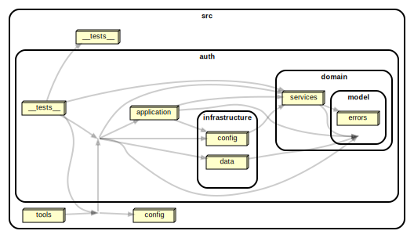

# Conduit - NestJS + TDD + Clean Architecture

This repo is a backend implementation of Conduit. Built with NestJS applying Test-Driven Development (TDD) and Clean Architecture principles. This repository contains the backend part of the Conduit application.



## Coverage

[](https://codecov.io/github/alxestevam/tdd-clean-arch-nestjs-real-world)

## Features

- **Authentication**: Sign up, log in functionality.

## Built With

- **[NestJS](https://nestjs.com/)**: A progressive Node.js framework for building efficient, reliable, and scalable server-side applications.
- **Clean Architecture**: An architecture model that emphasizes the separation of concerns, making the system more understandable, flexible, and maintainable.
- **Test-Driven Development (TDD)**: Development approach that relies on the repetition of a very short development cycle: requirements are turned into very specific test cases, then the software is improved to pass the new tests.

## Installation

Before running the server, make sure you have [Node.js](https://nodejs.org/en/) and [npm](https://www.npmjs.com/) installed on your machine.

```bash
# Install dependencies
yarn install

# Copy the example env file and make necessary changes in .env
cp .env.example .env
```

## Running the tests

This project uses [Jest](https://jestjs.io/) as its testing framework. To run the tests, use the following command:

```bash
# Run tests
yarn test
```

## Start the Server

To start the server, use the following command:

```bash
# Start the server
yarn start
```

The server will be running at [http://localhost:3000](http://localhost:3000).

## License

This project is licensed under the MIT License - see the [LICENSE](LICENSE) file for details.

## Contributors

We appreciate any contribution and acknowledge that this project exists thanks to all the people who contribute.

## Contact

If you have any question or suggestion, don't hesitate to use the [issues web page](https://github.com/alxestevam/tdd-clean-arch-nestjs-real-world/issues).
